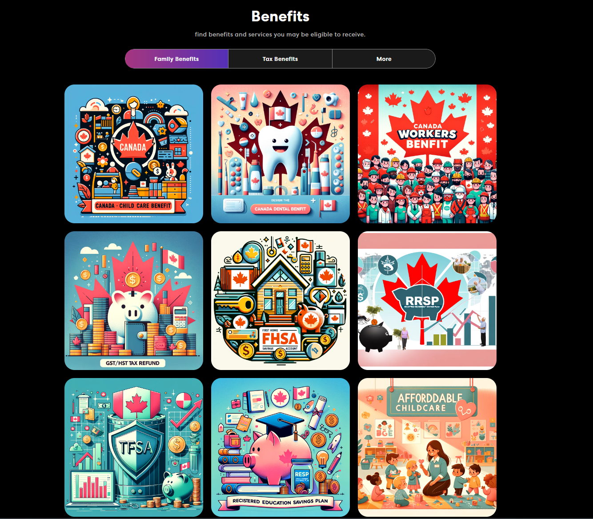

# Project Title
Benefits Calculator
## Overview

Benefits Calculator is an application for Canadian families to calculator what benefits they are entitled to and help them to optimize their benefits.

### Problem

Canada is famouse for the heavy tax, and also its benefits. Many people are not aware of what benefits they are entitled to and what help they can get.Through this application, families can have access to the benefits and get the help they need in time.

### User Profile

Canadian tax residents age from 18:
-looking for what benefits they are entitled to 
-understanding how they can get the benefits

### Features
-as a user, I want to be able to calculate what benefits I'm entitled to 
-as a user, I want to be able to have an estimate how much money I can receive
-as a user, I want to be able to connect with the resources I need 

## Implementation

### Tech Stack

-React
-TypeScript
-MySQL
-Express
-Client libraries:
 -react
 -react-router
 -axios
 -chart.js
-Server libraries:
-knex
-express

### APIs

- No external APIs will be used for the first sprint

### Sitemap

-Home Page
-Benefits
-Caculator
-Contact 

### Mockups

### Data
The Canadian Benefits Calculator utilizes official data sourced from government websites and publications to estimate users' entitlements to various benefits. This section outlines the data sources and methodology employed to ensure accuracy and reliability.

Data Points
Eligibility Criteria: Specific conditions that applicants must meet to qualify for each benefit, such as age, income level, residency status, and family composition.
Benefit Rates: The amount of money that eligible individuals or families can receive, which may vary based on income, the number of dependents, and other factors.
Calculation Formulas: Official formulas provided by the government to determine benefit amounts, incorporating factors like income thresholds and maximum benefit limits.
Sources
Canada Revenue Agency (CRA): Primary source for data on RRSP, TFSA, FHSA, CCB, and CWB, including contribution limits, tax implications, and benefit rates.
Employment and Social Development Canada (ESDC): Offers comprehensive details on social programs, including the Canada Dental Benefit and eligibility for various family and child benefits.
Income Tax Act: Legal framework governing tax benefits and savings plans, serving as a reference for specific program rules and calculations.

### Endpoints

GET /benefits/calculate

Description: Calculates the estimated benefits based on the user's input data.
Parameters:
- age: Integer, required
- income: Float, required
- numberOfChildren: Integer, optional

Example Request:
GET https://api.benefitscalculator.com/v1/benefits/calculate?age=30&income=50000&numberOfChildren=2

Example Response:
{
  "ccBenefit": "500",
  "dentalBenefit": "200",
  "workersBenefit": "800"
}

### Auth

No

## Roadmap
- Create client
    - react project with routes and boilerplate pages

- Create server
    - express project with routing, with placeholder 200 responses

- Create migrations

- Gather 20 sample benefits 

- Create seeds with sample café data

- Deploy client and server projects so all commits will be reflected in production

- Feature: List benefits from a given user
    - Implement benefits page
    - Store given benefits
    - Create GET /benefits endpoint

- Feature: View benefits
    - Implement view benefits
    - Create GET /benefits-url endpoint

- Feature: Calculate benefits
    - Add form input to caculate page
    - Create charts to show the data visualization
    

- Feature: Home page

- Feature: Create account
    - Implement register page + form
    - Create POST /users/register endpoint

- Bug fixes

- DEMO DAY

## Nice-to-haves

